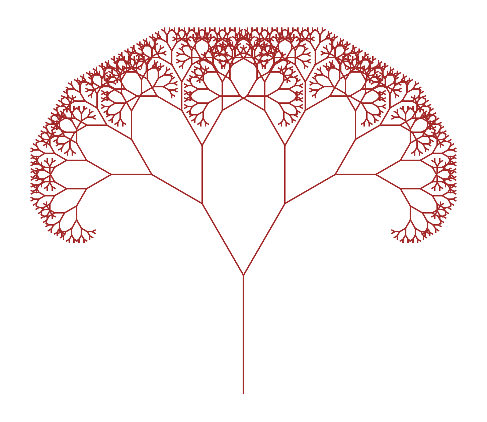

# Visual Recursion - Fractal Tree Generator

A Python program that demonstrates the power of recursion through beautiful fractal tree visualization using matplotlib.

## Description

This project creates stunning fractal trees using recursive algorithms. Each branch splits into two smaller branches at specific angles, creating a natural tree-like structure that showcases the mathematical beauty of recursion.

## Features

- **Recursive Algorithm**: Demonstrates how recursion can create complex patterns from simple rules
- **Fractal Geometry**: Creates self-similar patterns at different scales
- **Visual Output**: Uses matplotlib to render beautiful tree structures
- **Customizable Parameters**: Easy to modify branch angles, length ratios, and stopping conditions

## Requirements

- Python 3.x
- matplotlib
- math (built-in)

## Installation

1. Clone this repository:
```bash
git clone <repository-url>
cd python-classwork
```

2. Install required dependencies:
```bash
pip install matplotlib
```

## Usage

Run the program to generate a fractal tree:

```bash
python visualrecursion.py
```

The program will display a window with the generated fractal tree.

## How It Works

### The Recursive Algorithm

The core of the program is the `draw_branch()` function which:

1. **Base Case**: Stops recursion when branch length becomes too small (< 2 units)
2. **Calculation**: Computes the end point of each branch using trigonometry
3. **Drawing**: Renders the current branch as a brown line
4. **Recursion**: Creates two smaller branches at ±30° angles, each 70% the length of the parent

### Parameters

- **Starting Position**: (0, 0)
- **Initial Length**: 100 units
- **Initial Angle**: 90° (straight up)
- **Branch Angle**: ±30° from parent branch
- **Length Reduction**: 70% of parent branch length
- **Stop Condition**: Length < 2 units

## Code Structure

```python
def draw_branch(x, y, length, angle, ax):
    # Recursive function that draws individual branches
    
def draw_tree():
    # Main function that sets up the plot and starts recursion
```

## Customization

You can modify the following parameters to create different tree patterns:

- **Branch angles**: Change the `±30` values in the recursive calls
- **Length ratio**: Modify the `0.7` multiplier for different branch proportions
- **Stop condition**: Adjust the `length < 2` threshold
- **Colors**: Change the `color="brown"` parameter
- **Line thickness**: Modify the `linewidth=1` parameter

## Mathematical Concepts

This program demonstrates several important concepts:

- **Recursion**: Self-referential function calls
- **Fractals**: Self-similar patterns at different scales
- **Trigonometry**: Using sine and cosine to calculate branch endpoints
- **Coordinate Geometry**: Plotting points and lines in 2D space

## Example Output

The program generates a fractal tree that resembles natural tree growth patterns, with branches that split and become progressively smaller, creating a visually appealing and mathematically interesting structure.



*Generated fractal tree using recursive algorithm with 30° branch angles and 70% length reduction*

## Learning Objectives

- Understanding recursive algorithms
- Visualizing mathematical concepts
- Working with matplotlib for graphics
- Exploring fractal geometry
- Applying trigonometry in programming

## License

This project is created for educational purposes.

## Contributing

Feel free to fork this project and experiment with different parameters to create unique tree patterns!